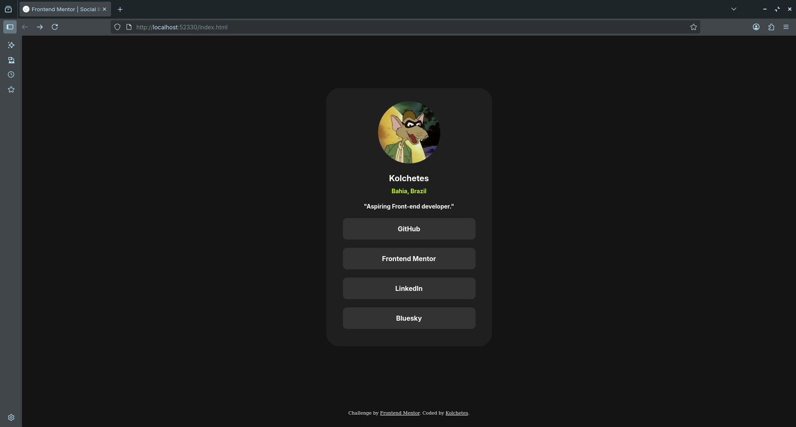
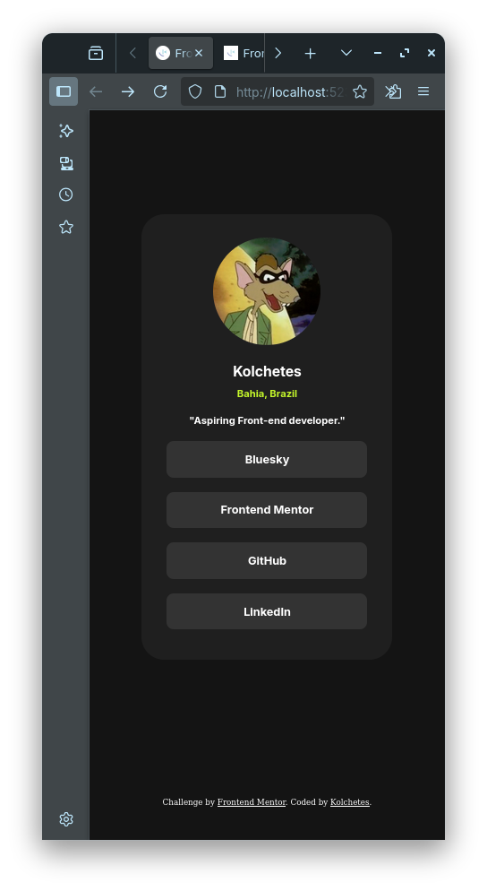

# Frontend Mentor - Social links profile solution

This is a solution to the [Social links profile challenge on Frontend Mentor](https://www.frontendmentor.io/challenges/social-links-profile-UG32l9m6dQ). Frontend Mentor challenges help you improve your coding skills by building realistic projects. 

## Table of contents

- [Overview](#overview)
  - [The challenge](#the-challenge)
  - [Screenshot](#screenshot)
  - [Links](#links)
- [My process](#my-process)
  - [Built with](#built-with)
  - [What I learned](#what-i-learned)
  - [Useful resources](#useful-resources)
- [Author](#author)

**Note: Delete this note and update the table of contents based on what sections you keep.**

## Overview

### The challenge

Users should be able to:

- See hover and focus states for all interactive elements on the page

### Screenshot




### Links

- Solution URL: [Add solution URL here](https://www.frontendmentor.io/solutions/social-profile-with-semantic-html-and-acessibility-cPESNtkYW0)
- Live Site URL: [Add live site URL here](https://kolchetes.github.io/social-links-profile/)

## My Process

### Built with

- Semantic HTML5 markup
- CSS custom properties
- Flexbox

### What I learned

I learned a new way to use font sizes, that has better accessibility, and learned that nesting links inside buttons is a bad practice.

```css
:root {
    /* declaring font sizes */
    --font-size-base: 1rem; /* 16px*/
    --font-size-paragraph: 0.875rem; /* 14px */
    --font-size-title: 1.25rem; /* 20px */
    --ten-pixels: 0.625rem;
}

html {
    font-size: 100%;
} 
```

### Useful resources

- [Frontend Mentor breakdown about font sizes](https://bsky.app/profile/frontendmentor.io/post/3lsebbsj53423) - It really helped me understanding why I shoudn't use the "62.5% font trick" on every project. Now I'm aware that the easy way is not always the best for everyone.

## Author

- Website - [kolchetes](https://github.com/kolchetes)
- Frontend Mentor - [@kolchetes](https://www.frontendmentor.io/profile/kolchetes)
- Bluesky - [@kolchetes](https://bsky.app/profile/kolchetes.bsky.social)
